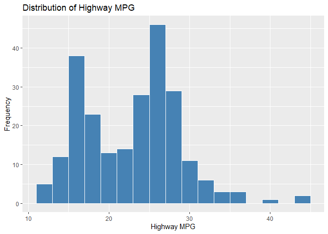
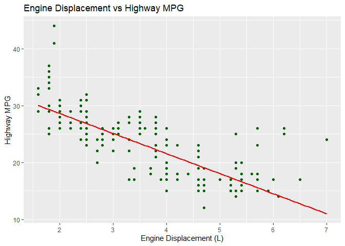
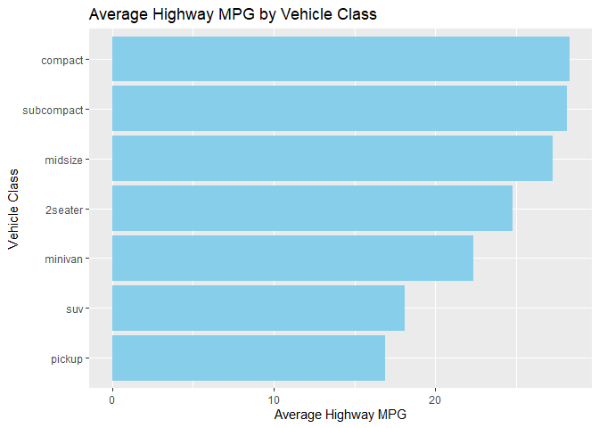

Fuel economy Presentation
================
Odia
2026-07-17

# Introduction

This report presents an exploratory data analysis (EDA) of the `mpg`
dataset. The dataset contains fuel economy information for various car
models manufactured between 1999 and 2008. The objective is to
understand the relationships between vehicle characteristics and fuel
efficiency.

# Dataset Description

The `mpg` dataset contains **234 observations** and **11 variables**.

| Variable     | Description                          |
|--------------|--------------------------------------|
| manufacturer | Car manufacturer                     |
| model        | Model name                           |
| displ        | Engine displacement (litres)         |
| year         | Model year                           |
| cyl          | Number of cylinders                  |
| trans        | Transmission type                    |
| drv          | Drive type (front, rear, four-wheel) |
| cty          | City miles per gallon                |
| hwy          | Highway miles per gallon             |
| fl           | Fuel type                            |
| class        | Vehicle class                        |

    ## Rows: 234
    ## Columns: 11
    ## $ manufacturer <chr> "audi", "audi", "audi", "audi", "audi", "audi", "audi", "…
    ## $ model        <chr> "a4", "a4", "a4", "a4", "a4", "a4", "a4", "a4 quattro", "…
    ## $ displ        <dbl> 1.8, 1.8, 2.0, 2.0, 2.8, 2.8, 3.1, 1.8, 1.8, 2.0, 2.0, 2.…
    ## $ year         <int> 1999, 1999, 2008, 2008, 1999, 1999, 2008, 1999, 1999, 200…
    ## $ cyl          <int> 4, 4, 4, 4, 6, 6, 6, 4, 4, 4, 4, 6, 6, 6, 6, 6, 6, 8, 8, …
    ## $ trans        <chr> "auto(l5)", "manual(m5)", "manual(m6)", "auto(av)", "auto…
    ## $ drv          <chr> "f", "f", "f", "f", "f", "f", "f", "4", "4", "4", "4", "4…
    ## $ cty          <int> 18, 21, 20, 21, 16, 18, 18, 18, 16, 20, 19, 15, 17, 17, 1…
    ## $ hwy          <int> 29, 29, 31, 30, 26, 26, 27, 26, 25, 28, 27, 25, 25, 25, 2…
    ## $ fl           <chr> "p", "p", "p", "p", "p", "p", "p", "p", "p", "p", "p", "p…
    ## $ class        <chr> "compact", "compact", "compact", "compact", "compact", "c…

    ##     manufacturer       model         displ            year           cyl       
    ##  Length   :234   Length   :234   Min.   :1.600   Min.   :1999   Min.   :4.000  
    ##  N.unique : 15   N.unique : 38   1st Qu.:2.400   1st Qu.:1999   1st Qu.:4.000  
    ##  N.blank  :  0   N.blank  :  0   Median :3.300   Median :2004   Median :6.000  
    ##  Min.nchar:  4   Min.nchar:  2   Mean   :3.472   Mean   :2004   Mean   :5.889  
    ##  Max.nchar: 10   Max.nchar: 22   3rd Qu.:4.600   3rd Qu.:2008   3rd Qu.:8.000  
    ##                                  Max.   :7.000   Max.   :2008   Max.   :8.000  
    ##        trans            drv           cty             hwy       
    ##  Length   :234   Length   :234   Min.   : 9.00   Min.   :12.00  
    ##  N.unique : 10   N.unique :  3   1st Qu.:14.00   1st Qu.:18.00  
    ##  N.blank  :  0   N.blank  :  0   Median :17.00   Median :24.00  
    ##  Min.nchar:  8   Min.nchar:  1   Mean   :16.86   Mean   :23.44  
    ##  Max.nchar: 10   Max.nchar:  1   3rd Qu.:19.00   3rd Qu.:27.00  
    ##                                  Max.   :35.00   Max.   :44.00  
    ##          fl            class    
    ##  Length   :234   Length   :234  
    ##  N.unique :  5   N.unique :  7  
    ##  N.blank  :  0   N.blank  :  0  
    ##  Min.nchar:  1   Min.nchar:  3  
    ##  Max.nchar:  1   Max.nchar: 10  
    ## 

# Data Exploration

## First Six Observations

    ## # A tibble: 6 × 11
    ##   manufacturer model displ  year   cyl trans      drv     cty   hwy fl    class 
    ##   <chr>        <chr> <dbl> <int> <int> <chr>      <chr> <int> <int> <chr> <chr> 
    ## 1 audi         a4      1.8  1999     4 auto(l5)   f        18    29 p     compa…
    ## 2 audi         a4      1.8  1999     4 manual(m5) f        21    29 p     compa…
    ## 3 audi         a4      2    2008     4 manual(m6) f        20    31 p     compa…
    ## 4 audi         a4      2    2008     4 auto(av)   f        21    30 p     compa…
    ## 5 audi         a4      2.8  1999     6 auto(l5)   f        16    26 p     compa…
    ## 6 audi         a4      2.8  1999     6 manual(m5) f        18    26 p     compa…

## Structure of the Dataset

    ## tibble [234 × 11] (S3: tbl_df/tbl/data.frame)
    ##  $ manufacturer: chr [1:234] "audi" "audi" "audi" "audi" ...
    ##  $ model       : chr [1:234] "a4" "a4" "a4" "a4" ...
    ##  $ displ       : num [1:234] 1.8 1.8 2 2 2.8 2.8 3.1 1.8 1.8 2 ...
    ##  $ year        : int [1:234] 1999 1999 2008 2008 1999 1999 2008 1999 1999 2008 ...
    ##  $ cyl         : int [1:234] 4 4 4 4 6 6 6 4 4 4 ...
    ##  $ trans       : chr [1:234] "auto(l5)" "manual(m5)" "manual(m6)" "auto(av)" ...
    ##  $ drv         : chr [1:234] "f" "f" "f" "f" ...
    ##  $ cty         : int [1:234] 18 21 20 21 16 18 18 18 16 20 ...
    ##  $ hwy         : int [1:234] 29 29 31 30 26 26 27 26 25 28 ...
    ##  $ fl          : chr [1:234] "p" "p" "p" "p" ...
    ##  $ class       : chr [1:234] "compact" "compact" "compact" "compact" ...

## Summary Statistics

    ##     manufacturer       model         displ            year           cyl       
    ##  Length   :234   Length   :234   Min.   :1.600   Min.   :1999   Min.   :4.000  
    ##  N.unique : 15   N.unique : 38   1st Qu.:2.400   1st Qu.:1999   1st Qu.:4.000  
    ##  N.blank  :  0   N.blank  :  0   Median :3.300   Median :2004   Median :6.000  
    ##  Min.nchar:  4   Min.nchar:  2   Mean   :3.472   Mean   :2004   Mean   :5.889  
    ##  Max.nchar: 10   Max.nchar: 22   3rd Qu.:4.600   3rd Qu.:2008   3rd Qu.:8.000  
    ##                                  Max.   :7.000   Max.   :2008   Max.   :8.000  
    ##        trans            drv           cty             hwy       
    ##  Length   :234   Length   :234   Min.   : 9.00   Min.   :12.00  
    ##  N.unique : 10   N.unique :  3   1st Qu.:14.00   1st Qu.:18.00  
    ##  N.blank  :  0   N.blank  :  0   Median :17.00   Median :24.00  
    ##  Min.nchar:  8   Min.nchar:  1   Mean   :16.86   Mean   :23.44  
    ##  Max.nchar: 10   Max.nchar:  1   3rd Qu.:19.00   3rd Qu.:27.00  
    ##                                  Max.   :35.00   Max.   :44.00  
    ##          fl            class    
    ##  Length   :234   Length   :234  
    ##  N.unique :  5   N.unique :  7  
    ##  N.blank  :  0   N.blank  :  0  
    ##  Min.nchar:  1   Min.nchar:  3  
    ##  Max.nchar:  1   Max.nchar: 10  
    ## 

# Data Visualization

## Distribution of Highway Mileage

<!-- -->

## Engine Size vs Highway MPG

    ## `geom_smooth()` using formula = 'y ~ x'

<!-- -->

## Average Highway MPG by Vehicle Class

<!-- -->

# Key Findings

- The dataset contains information on **234 vehicles** from multiple
  manufacturers.
- Smaller engines generally achieve better highway fuel economy.
- Compact and subcompact vehicles tend to have the highest average
  highway MPG.
- SUVs and pickup trucks generally have lower fuel efficiency.
- There is a negative relationship between engine displacement and fuel
  economy.

# Conclusion

The exploratory analysis shows that vehicle characteristics such as
engine displacement and vehicle class significantly influence fuel
efficiency. Cars with smaller engines generally consume less fuel and
achieve higher highway mileage, while larger vehicles tend to be less
fuel efficient. Further analysis could investigate how transmission type
or drive type affects fuel economy.
